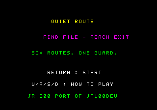
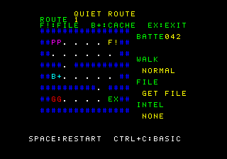
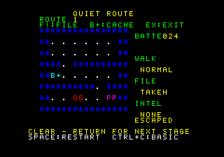

# QUIET ROUTE

JR100devの同名ステルスゲームをJR-200用に再実装した第2弾の候補作品です。

## 目的と勝敗

全6経路で機密`F!`を拾い、門`EX`から脱出します。任意の補給箱`B+`は追加情報と
電池6を与えます（上限50）。毎歩のあと警備員`GG`が反応します。通常歩行は電池1で
距離5未満、静音歩行は電池2で距離2未満の足音が聞こえます。警備員に捕まるか、
移動時に電池が必要量以下なら失敗です。失敗後は同じ経路の再挑戦確認ができます。

## 操作

- `W/A/S/D`: 上・左・下・右へ1マス移動。
- `RETURN`: 通常／静音歩行を切り替え。タイトルから開始し、クリア後は次の経路へ進みます。
- `SPACE`: その経路のやり直し確認。初期選択はNO。`A/D`で選んで`RETURN`で確定。
- `CTRL+C`: BASICへ戻ります。エミュレータのEscはBREAK/NMIと衝突するため案内しません。

壁`##`、空き道`. `、主人公`PP`、警備員`GG`、機密`F!`、補給箱`B+`、門`EX`を
文字と属性色の両方で区別します。画面に電池・歩行状態・機密・情報を表示します。
移動、取得、成功、失敗には音を付けています。

## 起動

所有ROM/FONTをエミュレータへ選択し、CJRをセットしてBASICで`MLOAD`、続いて
`A=USR($1000)`を入力します。ROM/FONTファイルは本作品に含まれません。

```sh
JRASM=/absolute/path/to/jrasm make -C games/quiet-route build
RUNNER_BUNDLE=/absolute/path/to/fixed/runner make -C games/quiet-route run
```

## 紹介画像と音付き動画





[1経路目の脱出までの音付き動画](media/goal.webm)は、所有ROM/FONTを用いた通常
MLOAD/USR後の画面全体を無加工で記録しました。メーカーFONTの字形が映る場合も
削除していません。媒体と実行reportの対応は[media/gallery.json](media/gallery.json)です。

## 検証の範囲

固定jrasmでCJRを生成し、固定WASM runnerで合成起動と所有ROM/FONTによる通常
MLOAD/USRを分けて実施しました。全6経路のクリア、補給、電池切れ、発見失敗の
RAM状態を独立ルールモデルと照合しました。合成profileではやり直しのNO/YES、
CTRL+C後の画面・属性・FONT・PCG・stack guardも照合しました。所有ROM/FONTを
使ったローカルブラウザでは通常MLOAD/USR、移動、BASIC復帰、画面復元と外部要求0件を
確認。物理JR-200と公開版の動作は未確認です。

## ライセンス

仕様の固定元は`jr100dev@9a3921c4371d84c55fc468879dbed2f00fe42960`の
`games/quiet_route/rules.py` 2.0.0です。JR-100のPRGやI/Oは流用していません。
SHA-256は[UPSTREAM.md](UPSTREAM.md)、移植固有コードのMIT全文は[LICENSE](LICENSE)、
共通SDKのBSD-3-Clause表示は[THIRD_PARTY_NOTICES.md](THIRD_PARTY_NOTICES.md)を参照してください。

この0.1.0は開発中で、Release・公開Web・公開Wikiには配信していません。公開には
作品版と配信先について別の承認が必要です。
