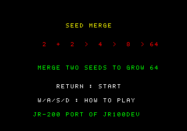
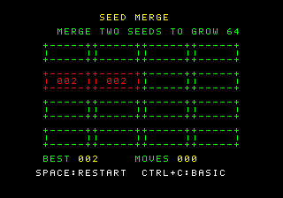
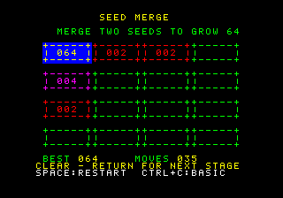

# SEED MERGE

JR100devの同名パズルをJR-200用に再実装した第2弾の候補作品です。

## 目的と勝敗

4×4盤面の種を滑らせ、同じ数字を合わせて64を作ります。盤面が動いた手だけ新しい2が出現します。
1手で合成された種は、同じ手でもう一度合成されません。空きと合成可能な隣接組が
なくなると失敗です。

## 操作

- `W/A/S/D`: 上・左・下・右へ盤面を滑らせる（方向はW=上、S=下、A=左、D=右）。
- `RETURN`: タイトルから開始、結果画面を次へ進める。
- `SPACE`: その局のやり直し確認。初期選択はNO。`A/D`で選んで`RETURN`で確定。
- `CTRL+C`: BASICへ戻る。エミュレータのEscはBREAK/NMIと衝突するため案内しません。

表示には各セルの数字と属性色、最大値と手数を使います。数字は色だけに依存しません。
操作時の移動・合成・出現に効果音を付けました。元の種の出現式
`seed = (seed * 5 + 1) & 255`と、そこからの空きセル探索順を維持しています。

## 起動

所有ROM/FONTをエミュレータへ選択し、CJRをセットしてBASICで`MLOAD`、続いて
`A=USR($1000)`を入力します。ROM/FONTファイルは本作品には含まれません。

```sh
JRASM=/absolute/path/to/jrasm make -C games/seed-merge build
RUNNER_BUNDLE=/absolute/path/to/fixed/runner make -C games/seed-merge run
```

## 紹介画像と音付き動画





[64到達までの音付き動画](media/goal.webm)は、所有ROM/FONTを用いた通常MLOAD/USR後の
画面全体を無加工で記録したものです。メーカーFONTの字形が映る場合も画像から削除しません。
媒体の固定hashと実行reportの対応は[media/gallery.json](media/gallery.json)を参照してください。

## 検証の範囲

固定jrasmでCJRを生成し、固定WASM runnerで合成起動と所有ROM/FONTによる通常
MLOAD/USRを分けて実施しました。4方向の1列625通りずつを独立規則モデルと比較し、
35手の64到達、24手の手詰まり、やり直しのNO/YES、CTRL+C後の画面・属性・フォント・
PCG復元を試験しています。PCMの非ゼロ出力も固定runnerで確認しています。
ブラウザでの手操作、物理JR-200、公開版の動作はまだ未確認です。
合成実行やCJR生成を実機の証拠とはしません。

## ライセンス

仕様の固定元は`jr100dev@9a3921c4371d84c55fc468879dbed2f00fe42960`の
`games/seed_merge/rules.py` 1.5.1です。JR-100のプログラムやI/Oは流用していません。
SHA-256は[UPSTREAM.md](UPSTREAM.md)、移植固有コードの全文ライセンスは[LICENSE](LICENSE)、
共通SDKのBSD-3-Clause表示は[THIRD_PARTY_NOTICES.md](THIRD_PARTY_NOTICES.md)を参照してください。

この0.1.0は開発中で、Release・公開Web・公開Wikiには配信していません。公開には
作品版と配信先について別の承認が必要です。
